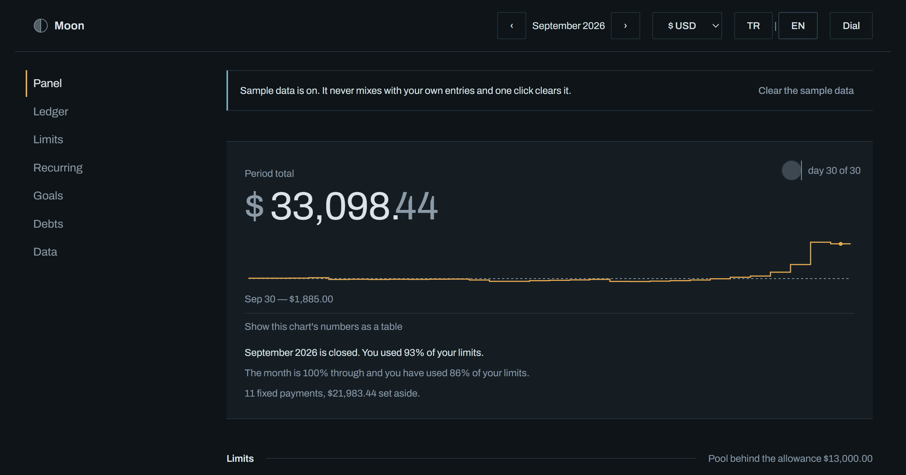

# Moon

A budget ledger that runs entirely in your browser. No account, no server, no build step,
no dependencies — one HTML file and a handful of plain JavaScript files.

**[Open Moon →](https://onuryildirim26.github.io/moon/)** · [Türkçe](#moon--bütçe-defteri)



---

## Why this exists

Most budget apps ask you to hand over your bank login, then show you a pie chart. Moon does
neither. You type what you spent, or drop in a CSV your bank already gives you, and it
answers the one question a budget is actually for:

> **How much can I spend today without going over?**

That number — the remaining daily allowance — is the first thing on the screen. It is
derived, not a raw balance: the money left in your variable limits divided by the days left
in the period. Fixed costs like rent are pulled out of that pool so one big payment on the
1st doesn't make the rest of the month look like a catastrophe.

## What it does

- **Write entries by hand** — date, amount, category, note. Ten seconds each.
- **Import a bank statement** — drop a CSV, map the columns once, review what came in.
  Turkish (`;` and `1.234,56`) and English (`,` and `1,234.56`) statements both work, along
  with BOM headers, quoted delimiters, preamble junk and repeated header rows.
- **Monthly limits per category** — shown as an instrument scale with a pace mark, so you
  see whether you are ahead of or behind the month, not just a percentage.
- **Recurring payments** — rent, bills, subscriptions. Marked as fixed so they stay out of
  the daily allowance and are reported separately.
- **Savings goals** — how much, by when, and what that means per month.
- **Debts** — who owes whom, settled or open. Never mixed into the budget maths.
- **Charts, hand-drawn in SVG** — an allowance trail, a day seismograph, a cumulative curve
  against a pace diagonal, and a twelve-month density grid. No chart library, and no pie
  chart anywhere: the human eye cannot compare eight angles.
- **Turkish and English**, switchable at any time. Four currencies.
- **Dark and light** — the dial and the paper. Follows your system unless you pick one.

## Your data

Everything lives in `localStorage`, under a single key, in your browser. It is never sent
anywhere, because there is nowhere to send it — Moon has no backend.

- **Back up** any time: one JSON file, human-readable, with every record in it.
- **Restore** it in another browser or on another machine, replacing or merging.
- **Storage is finite** (~5 MB, about ten years of ordinary use). If a write ever fails,
  Moon says so on screen and keeps your entry in memory rather than dropping it silently.
- **Private browsing** blocks storage in some browsers. Moon detects that, warns you, and
  runs as a read-only session instead of pretending to save.

The only outbound request the page makes is the Google Fonts stylesheet. Delete the three
font tags in `index.html` and Moon is completely offline — the fallback stacks in
`css/tokens.css` keep the layout intact.

## Running it

**Use the hosted copy:** <https://onuryildirim26.github.io/moon/>

**Or run it locally** — no toolchain required:

```bash
git clone https://github.com/onuryildirim26/moon.git
```

Then open `index.html` by double-clicking it. That is the whole setup. Moon is written
against `file://` on purpose: classic script tags, no ES modules, no `fetch`.

**Or serve it,** if you prefer a real origin:

```bash
python -m http.server 8791
```

Two sample statements are in `ornek/` if you want to try the importer before trusting it
with your own: `ornek-ekstre-tr.csv` (Turkish bank format) and `sample-statement-en.csv`.
There is also a sample month built into the app — one click to load, one to clear.

## How it is built

No framework, no bundler, no `package.json`. Each file is an IIFE that writes to one branch
of a single global, and `index.html` loads them in dependency order.

```
index.html          shell, script order, header controls
css/tokens.css      design tokens: colour, type, space, motion
css/moon.css        the entire stylesheet
js/core.js          Moon.util / Moon.bus / Moon.dom
js/money.js         integer minor units; parsing and formatting
js/dates.js         civil date strings; periods and flexible parsing
js/lang.tr.js       Turkish catalogue
js/lang.en.js       English catalogue
js/i18n.js          lookup, placeholders, plurals
js/store.js         localStorage, schema validation, migrations, export/import
js/model.js         records, validation, derived measurements
js/csv.js           encoding, delimiter sniffing, quote-aware parser
js/importer.js      column roles, duplicates, review
js/charts.js        five hand-written SVG charts + the limit scale
js/ui.js            dialogs, fields, money cells, undo strip, empty states
js/sample.js        the sample month
js/views.*.js       one file per section
js/app.js           boot, hash router, theme, period
```

Two decisions worth naming, because they are where money apps usually break:

**Money is always an integer number of minor units.** Never a float. `19.99 * 100` is
`1998.9999999999998` in IEEE-754, and a hundred subscriptions summed as floats will land on
the wrong side of a limit. Parsing works on the string, digit by digit — `parseFloat` is not
used anywhere.

**Dates are always `"YYYY-MM-DD"` local civil strings.** `Date` is a scratch tool, never
stored. `toISOString().slice(0, 10)` shifts an entry typed at 02:30 in Istanbul back a day,
and `new Date("2026-03-01")` is parsed as UTC. Comparing ISO strings sorts chronologically
and takes time zones out of the equation entirely.

### Adding a language

No string lives in a view, so the catalogue is the one place a third language has to touch.
German, for example:

1. Copy `js/lang.en.js` to `js/lang.de.js`, rename its one assignment from `Moon.Lang.en`
   to `Moon.Lang.de`, and translate the values. Keep the keys and their order, and keep
   every `{placeholder}` — `{count}` left out of a sentence shows up on screen as a literal
   brace.
2. Add one script tag to `index.html`, **after** `js/i18n.js`, because the next step calls it:

   ```html
   <script src="js/lang.de.js"></script>
   ```
3. End the new file with the registration:

   ```js
   Moon.I18n.register("de", Moon.Lang.de);
   ```

That is all of it. The language picker in the header builds itself from
`Moon.I18n.languages()`, so `DE` appears beside `TR` and `EN` on the next reload. A key you
have not translated yet falls back to English and says so in the console rather than
rendering blank, and `Moon.I18n._verify()` lists every missing key and every placeholder
that drifted between catalogues. Amounts and dates are not translated: they are formatted by
`Intl` from the code you registered, so `"de"` already groups thousands with a dot and marks
the decimal with a comma.

## Accessibility

Keyboard reachable throughout, with a visible focus ring that is never removed. Ledger rows
use arrow-key navigation. Charts carry `role="img"` with a title, a description, and a real
`<table>` underneath for screen readers and for printing. Colour is never the only channel:
an overrun is marked by a hatch pattern, a percentage, a sentence and an `aria-label` at the
same time. One polite live region, at the bottom of the page, for undo and warnings.

## Browser support

Current Chrome, Edge, Firefox and Safari, on desktop and phone. Nothing here needs a
polyfill; the newest things used are `<dialog>`, `content-visibility` and `TextDecoder`,
each with a fallback path.

## Support

Moon is free and MIT licensed. Nothing to pay, no account to open, nothing withheld — and
that is not going to change. If you would like to send something anyway, the **Sponsor**
button at the top of this repository is the shortest route. It buys nothing: there is no
feature behind it, no banner to remove, no advertisement you are not seeing. The app itself
never asks for money anywhere.

## Licence

MIT — see [LICENSE](LICENSE). Use it, fork it, ship your own version of it.

---

# Moon — bütçe defteri

Tamamen tarayıcında çalışan bir bütçe defteri. Hesap yok, sunucu yok, kurulum yok,
bağımlılık yok — bir HTML dosyası ve birkaç düz JavaScript dosyası.

**[Moon'u aç →](https://onuryildirim26.github.io/moon/)**

## Neden var

Bütçe uygulamalarının çoğu önce banka şifrenizi ister, sonra size bir pasta grafiği gösterir.
Moon ikisini de yapmaz. Ne harcadığını yazarsın, ya da bankanın zaten verdiği CSV ekstreyi
sürükleyip bırakırsın; uygulama da bütçenin asıl sorusunu cevaplar:

> **Bugün, sınırı aşmadan ne kadar harcayabilirim?**

Bu sayı — kalan günlük pay — ekrandaki ilk şey. Ham bir bakiye değil, türetilmiş bir ölçüm:
değişken limitlerinden kalan para, dönemde kalan güne bölünür. Kira gibi sabit giderler bu
havuzun dışında tutulur, böylece ayın 1'inde ödenen büyük bir kalem ayın geri kalanını
felaket gibi göstermez.

## Ne yapar

- **Elle kayıt** — tarih, tutar, kategori, açıklama. Her biri on saniye.
- **Ekstre yükleme** — CSV'yi bırak, sütunları bir kez eşleştir, geleni incele.
  Türk bankası biçimi (`;` ve `1.234,56`) ve İngilizce biçim (`,` ve `1,234.56`) birlikte
  çalışır; BOM'lu başlık, tırnak içindeki ayırıcı, baştaki serbest metin ve tekrar eden
  başlık satırları da.
- **Kategori başına aylık limit** — hız işaretli bir ölçek olarak gösterilir; yüzdeyi değil,
  ayın önünde mi gerisinde mi olduğunu görürsün.
- **Tekrarlayan ödemeler** — kira, faturalar, abonelikler. Sabit olarak işaretlenir, günlük
  payın dışında tutulur ve ayrı raporlanır.
- **Tasarruf hedefleri** — ne kadar, ne zamana, ayda kaça denk geliyor.
- **Borç ve alacak** — kim kime ne borçlu, ödendi mi. Bütçe hesabına asla karışmaz.
- **Elle yazılmış SVG grafikler** — pay izi, gün sismografı, hız köşegenine karşı kümülatif
  eğri ve on iki aylık yoğunluk ızgarası. Grafik kütüphanesi yok, hiçbir yerde pasta grafiği
  yok: insan gözü sekiz açıyı karşılaştıramaz.
- **Türkçe ve İngilizce**, her an değiştirilebilir. Dört para birimi.
- **Koyu ve açık** — kadran ve kâğıt. Sen seçmedikçe sistemini izler.

## Verin

Her şey tarayıcında, `localStorage` içinde tek bir anahtarda durur. Hiçbir yere gönderilmez,
çünkü gönderilecek bir yer yok — Moon'un sunucusu yoktur.

- **Yedek al**: tek bir JSON dosyası, insan tarafından okunabilir, içinde her kayıt var.
- **Geri yükle**: başka bir tarayıcıda ya da başka bir bilgisayarda, değiştirerek veya
  birleştirerek.
- **Depolama sınırlı** (~5 MB, sıradan kullanımda yaklaşık on yıl). Bir yazma başarısız
  olursa Moon bunu ekranda söyler ve girdiğin kaydı sessizce düşürmek yerine bellekte tutar.
- **Gizli sekmede** bazı tarayıcılar depolamayı kapatır. Moon bunu fark eder, uyarır ve
  kaydediyormuş gibi yapmak yerine salt-okunur bir oturum olarak çalışır.

Sayfanın yaptığı tek dış istek Google Fonts stil dosyasıdır. `index.html` içindeki üç yazı
tipi satırını silersen Moon tamamen çevrimdışı olur; `css/tokens.css` içindeki yedek yazı
tipi zincirleri düzeni bozmadan devralır.

## Nasıl çalıştırılır

**Yayındaki kopyayı kullan:** <https://onuryildirim26.github.io/moon/>

**Ya da kendi bilgisayarında** — hiçbir araç kurmadan:

```bash
git clone https://github.com/onuryildirim26/moon.git
```

Sonra `index.html` dosyasına çift tıkla. Kurulum bundan ibaret. Moon bilerek `file://` ile
çalışacak şekilde yazıldı: klasik script etiketleri, ES module yok, `fetch` yok.

Denemek için `ornek/` klasöründe iki örnek ekstre var: `ornek-ekstre-tr.csv` ve
`sample-statement-en.csv`. Uygulamanın içinde de hazır bir örnek ay var — bir tuşla yüklenir,
bir tuşla temizlenir.

## Dil eklemek

Hiçbir metin görünümlerin içinde durmaz; üçüncü bir dilin dokunacağı tek yer katalog.
Örnek olarak Almanca:

1. `js/lang.en.js` dosyasını `js/lang.de.js` olarak kopyala, içindeki tek atamayı
   `Moon.Lang.en`'den `Moon.Lang.de`'ye al, sonra değerleri çevir. Anahtarları ve sıralarını
   koru; `{yer tutucu}` işaretlerini de — cümleden düşen bir `{count}` ekranda süslü
   parantezin kendisi olarak görünür.
2. `index.html`'e tek bir script satırı ekle; bir sonraki adım onu çağırdığı için
   **`js/i18n.js`'ten sonra** olacak:

   ```html
   <script src="js/lang.de.js"></script>
   ```
3. Yeni dosyanın sonuna kaydı yaz:

   ```js
   Moon.I18n.register("de", Moon.Lang.de);
   ```

Hepsi bu. Başlıktaki dil seçici kendini `Moon.I18n.languages()` üzerinden kurar, yani `DE`
bir sonraki açılışta `TR` ve `EN`'in yanında belirir. Henüz çevirmediğin bir anahtar boş
kalmaz, İngilizcesine düşer ve bunu konsolda söyler; `Moon.I18n._verify()` da eksik
anahtarları ve kataloglar arasında kayan yer tutucuları sıralar. Tutar ve tarih biçimi
katalogda değil: kaydettiğin dil kodundan `Intl` ile kurulur, yani `"de"` binlikleri noktayla,
ondalığı virgülle yazar.

## Destek olmak

Moon ücretsiz ve MIT lisanslı; hiçbir şey ödemeden, hesap açmadan, bir şey sormadan
kullanılır ve öyle kalacak. Yine de bir şey göndermek istersen en kısa yol bu deponun en
üstündeki **Sponsor** düğmesi. Bir karşılığı yok: açılmayan özellik, kapanmayan bant,
görmediğin bir reklam yok. Uygulamanın kendisi hiçbir yerde para istemez.

## Lisans

MIT — [LICENSE](LICENSE) dosyasına bak. Kullan, çatalla, kendi sürümünü yayınla.
