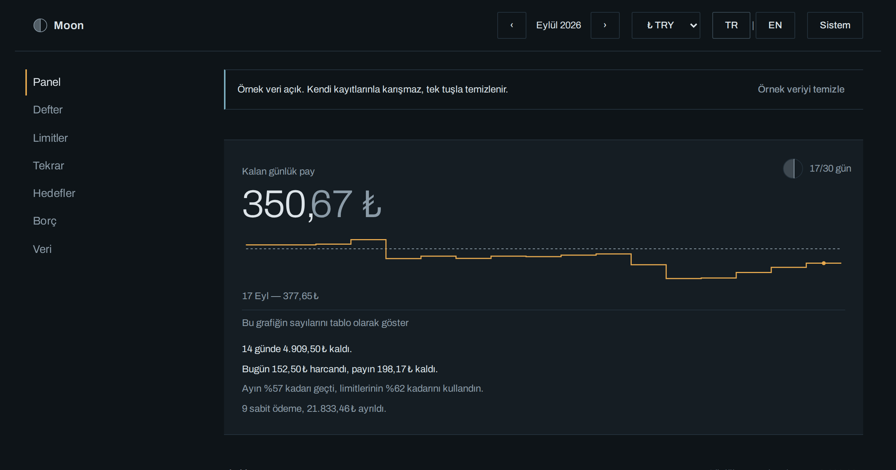

# Moon — bütçe defteri

[](https://github.com/onuryildirim26/moon/actions/workflows/test.yml)
[](LICENSE)

[](https://onuryildirim26.github.io/moon/)

Tamamen tarayıcında çalışan bir bütçe defteri. Hesap yok, sunucu yok, kurulum yok,
bağımlılık yok — bir HTML dosyası ve birkaç düz JavaScript dosyası.

**[Moon'u aç →](https://onuryildirim26.github.io/moon/)** · [English](README.md) · Türkçe

<picture>
  <source media="(prefers-color-scheme: light)" srcset="assets/onizleme-tr-light.png">
  
</picture>

---

## Neden var

Bütçe uygulamalarının çoğu önce banka şifrenizi ister, sonra size bir pasta grafiği gösterir.
Moon ikisini de yapmaz. Ne harcadığını yazarsın, ya da bankanın zaten verdiği CSV ekstreyi
sürükleyip bırakırsın; uygulama da bütçenin asıl sorusunu cevaplar:

> **Bugün, sınırı aşmadan ne kadar harcayabilirim?**

Bu sayı — kalan günlük pay — ekrandaki ilk şey. Ham bir bakiye değil, türetilmiş bir ölçüm:
değişken limitlerinden kalan para, dönemde kalan güne bölünür. Kira gibi sabit giderler bu
havuzun dışında tutulur, böylece ayın 1'inde ödenen büyük bir kalem ayın geri kalanını
felaket gibi göstermez.

## Ne yapar

- **Elle kayıt** — tarih, tutar, kategori, açıklama. Her biri on saniye.
- **Ekstre yükleme** — CSV'yi bırak, sütunları bir kez eşleştir, geleni incele.
  Türk bankası biçimi (`;` ve `1.234,56`) ve İngilizce biçim (`,` ve `1,234.56`) birlikte
  çalışır; BOM'lu başlık, tırnak içindeki ayırıcı, baştaki serbest metin ve tekrar eden
  başlık satırları da.
- **Kategori başına aylık limit** — hız işaretli bir ölçek olarak gösterilir; yüzdeyi değil,
  ayın önünde mi gerisinde mi olduğunu görürsün.
- **Tekrarlayan ödemeler** — kira, faturalar, abonelikler. Sabit olarak işaretlenir, günlük
  payın dışında tutulur ve ayrı raporlanır.
- **Tasarruf hedefleri** — ne kadar, ne zamana, ayda kaça denk geliyor.
- **Borç ve alacak** — kim kime ne borçlu, ödendi mi. Bütçe hesabına asla karışmaz.
- **Elle yazılmış SVG grafikler** — pay izi, gün sismografı, hız köşegenine karşı kümülatif
  eğri ve on iki aylık yoğunluk ızgarası. Grafik kütüphanesi yok, hiçbir yerde pasta grafiği
  yok: insan gözü sekiz açıyı karşılaştıramaz.
- **Türkçe ve İngilizce**, her an değiştirilebilir. Dört para birimi.
- **Koyu ve açık** — kadran ve kâğıt. Sen seçmedikçe sistemini izler.

## Verin

Her şey tarayıcında, `localStorage` içinde tek bir anahtarda durur. Hiçbir yere gönderilmez,
çünkü gönderilecek bir yer yok — Moon'un sunucusu yoktur.

- **Yedek al**: tek bir JSON dosyası, insan tarafından okunabilir, içinde her kayıt var.
- **Geri yükle**: başka bir tarayıcıda ya da başka bir bilgisayarda, değiştirerek veya
  birleştirerek.
- **Depolama sınırlı** (~5 MB, sıradan kullanımda yaklaşık on yıl). Bir yazma başarısız
  olursa Moon bunu ekranda söyler ve girdiğin kaydı sessizce düşürmek yerine bellekte tutar.
- **Gizli sekmede** bazı tarayıcılar depolamayı kapatır. Moon bunu fark eder, uyarır ve
  kaydediyormuş gibi yapmak yerine salt-okunur bir oturum olarak çalışır.

Sayfanın yaptığı tek dış istek Google Fonts stil dosyasıdır. `index.html` içindeki üç yazı
tipi satırını silersen Moon tamamen çevrimdışı olur; `css/tokens.css` içindeki yedek yazı
tipi zincirleri düzeni bozmadan devralır.

## Nasıl çalıştırılır

**Yayındaki kopyayı kullan:** <https://onuryildirim26.github.io/moon/>

**Ya da kendi bilgisayarında** — hiçbir araç kurmadan:

```bash
git clone https://github.com/onuryildirim26/moon.git
```

Sonra `index.html` dosyasına çift tıkla. Kurulum bundan ibaret. Moon bilerek `file://` ile
çalışacak şekilde yazıldı: klasik script etiketleri, ES module yok, `fetch` yok.

Denemek için `ornek/` klasöründe iki örnek ekstre var: `ornek-ekstre-tr.csv` ve
`sample-statement-en.csv`. Uygulamanın içinde de hazır bir örnek ay var — bir tuşla yüklenir,
bir tuşla temizlenir.

## Testler

README'deki sözler her push'ta kontrol edilir:

```bash
node --test tests/*.test.js
```

Node 20 veya üstü yeterli, kurulacak bir şey yok. `tests/load.js` script sırasını
`index.html`'in kendisinden okur ve aynı dosyaları bir Node `vm` bağlamına yükler; testler
sayfanın yüklediği kodu çalıştırır, bir kopyasını değil. Paket money, dates, csv, store, model
ve importer içinde zaten bulunan `_selftest()` fonksiyonlarını çalıştırır ve buradaki iddialar
için ayrıca şunlara bakar:

- tutarlar tam sayı çıkar; yüz tane `19.99`'un toplamı tam olarak `199900` olur;
- gece yarısından hemen sonra girilen kayıt İstanbul, Los Angeles, Auckland ve UTC'de gününü
  korur; gün hesabı yaz saati geçişinde kaymaz;
- iki örnek ekstre de okunur ve Türkçe ekstredeki her bakiye kuruşu kuruşuna tutar;
- BOM'lu başlık, tırnak içindeki ayırıcı, baştaki serbest metin, `sep=;` ve tekrar eden başlık;
- Türkçe ve İngilizce katalogların anahtarları ve yer tutucuları aynıdır;
- kaynakta `parseFloat(`, `fetch` ve module sözdizimi yoktur; `index.html` Google Fonts dışında
  uzaktan bir şey yüklemez.

## Dil eklemek

Hiçbir metin görünümlerin içinde durmaz; üçüncü bir dilin dokunacağı tek yer katalog.
Örnek olarak Almanca:

1. `js/lang.en.js` dosyasını `js/lang.de.js` olarak kopyala, içindeki tek atamayı
   `Moon.Lang.en`'den `Moon.Lang.de`'ye al, sonra değerleri çevir. Anahtarları ve sıralarını
   koru; `{yer tutucu}` işaretlerini de — cümleden düşen bir `{count}` ekranda süslü
   parantezin kendisi olarak görünür.
2. `index.html`'e tek bir script satırı ekle; bir sonraki adım onu çağırdığı için
   **`js/i18n.js`'ten sonra** olacak:

   ```html
   <script src="js/lang.de.js"></script>
   ```
3. Yeni dosyanın sonuna kaydı yaz:

   ```js
   Moon.I18n.register("de", Moon.Lang.de);
   ```

Hepsi bu. Başlıktaki dil seçici kendini `Moon.I18n.languages()` üzerinden kurar, yani `DE`
bir sonraki açılışta `TR` ve `EN`'in yanında belirir. Henüz çevirmediğin bir anahtar boş
kalmaz, İngilizcesine düşer ve bunu konsolda söyler; `Moon.I18n._verify()` da eksik
anahtarları ve kataloglar arasında kayan yer tutucuları sıralar. Tutar ve tarih biçimi
katalogda değil: kaydettiğin dil kodundan `Intl` ile kurulur, yani `"de"` binlikleri noktayla,
ondalığı virgülle yazar.

## Destek olmak

Moon ücretsiz ve MIT lisanslı; hiçbir şey ödemeden, hesap açmadan, bir şey sormadan
kullanılır ve öyle kalacak. Bir akşamını kurtardıysa ve bir şey göndermek istersen bir
kahve var. Bir karşılığı yok: açılmayan özellik, kapanmayan bant, görmediğin bir reklam
yok. Uygulamanın kendisi hiçbir yerde para istemez, istemeyecek.

[](https://buymeacoffee.com/onuryildirim26)

## Lisans

MIT — [LICENSE](LICENSE) dosyasına bak. Kullan, çatalla, kendi sürümünü yayınla.
